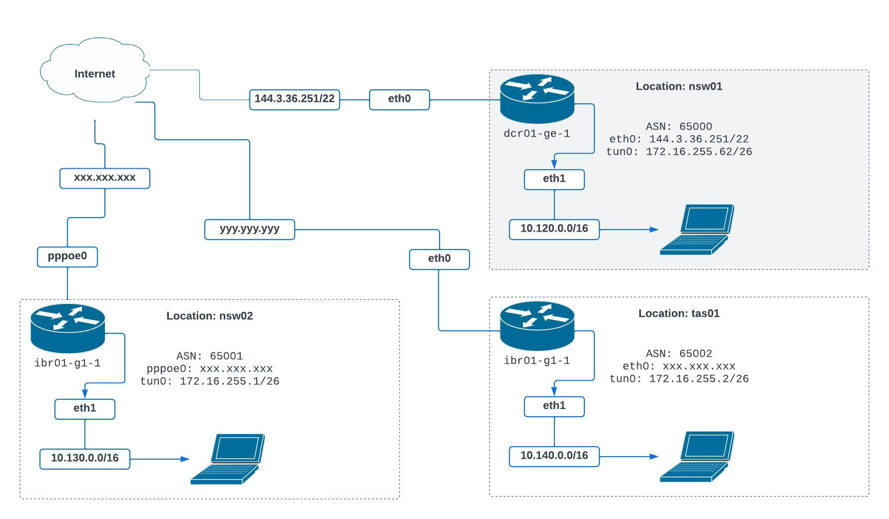

DMVPN and BGP configuration
============================



General Configuration
------------------

### Configure Hostname

```
# Hub
set system host-name dcr01-ge-1.nsw01

# Spokes
set system host-name ibr01-ge-1.tas01
set system host-name ibr01-ge-1.nsw02
```

### Configure network interface eth0 (internet)

Note: At the site `nsw02` the internet configuration will use pppoe because
NBN VDSL. `nsw01` and `tas01` will use the configuation below.

#### NBN

```
set interfaces ethernet eth0 address dhcp
set interfaces ethernet eth0 description 'net-outside'
```

#### NBN VDSL
```
set interfaces pppoe pppoe0 default-route 'auto'
set interfaces pppoe pppoe0 mtu 1492 # ew
set interfaces pppoe pppoe0 authentication user 'xxxx'
set interfaces pppoe pppoe0 authentication password 'yyyy'
set interfaces pppoe pppoe0 source-interface 'eth0'
```

### Configure network interface eth1.10 (dmz)

Depending on the site the LAN configuration might be different.

```
set interfaces ethernet eth1 vif 10 address 10.120.10.1/24
set interfaces ethernet eth1 vif 10 description "net-googong-dmz"
```

### Enable SSH for remote access

```
set service ssh listen-address 0.0.0.0
set service ssh port 22
```


### Configure DHCP Server

REplace `10.120.0.0/16` with the subnet of the site.

```
set service dhcp-server listen-address '10.120.10.1'
set service dhcp-server shared-network-name net-googong-dmz domain-name 'sombernet.au'
set service dhcp-server shared-network-name net-googong-dmz name-server '10.110.10.1'
set service dhcp-server shared-network-name net-googong-dmz subnet 10.120.10.0/24 default-router '10.120.10.1'
set service dhcp-server shared-network-name net-googong-dmz subnet 10.120.10.0/24 range 0 start '10.120.10.100'
set service dhcp-server shared-network-name net-googong-dmz subnet 10.120.10.0/24 range 0 stop '10.120.10.200'
```

### Configure Dynamic DNS

	set service dns dynamic interface eth0 ipv6-enable
	set service dns dynamic interface eth0 service cloudflare host-name 'dcr01-ge-1.nsw01.sombernet.au'
	set service dns dynamic interface eth0 service cloudflare login 'mark@hahl.id.au'
	set service dns dynamic interface eth0 service cloudflare password '__api_token__'
	set service dns dynamic interface eth0 service cloudflare zone 'sombernet.au'


## DMVPN Configuration

### Configure Gre tunnel

The hub has a static address for the WAN connection (144.6.36.251)

```
set interfaces tunnel tun0 address '172.16.254.62/26'
set interfaces tunnel tun0 enable-multicast
set interfaces tunnel tun0 encapsulation 'gre'
set interfaces tunnel tun0 parameters ip key '1'
set interfaces tunnel tun0 source-address '144.6.36.251'
```


### Configure NHRP. 
```
set protocols nhrp tunnel tun0 cisco-authentication 'xxxxxxxx'
set protocols nhrp tunnel tun0 holding-time '300'
set protocols nhrp tunnel tun0 multicast 'dynamic'
set protocols nhrp tunnel tun0 redirect
set protocols nhrp tunnel tun0 shortcut
```

### Configure IPSec VPN

```
set vpn ipsec interface 'eth0'

set vpn ipsec esp-group ESP-DMVPN lifetime '1800'
set vpn ipsec esp-group ESP-DMVPN mode 'transport'
set vpn ipsec esp-group ESP-DMVPN pfs 'dh-group2'
set vpn ipsec esp-group ESP-DMVPN proposal 1 encryption 'aes256'
set vpn ipsec esp-group ESP-DMVPN proposal 1 hash 'sha1'

set vpn ipsec ike-group IKE-DMVPN key-exchange 'ikev1'
set vpn ipsec ike-group IKE-DMVPN lifetime '3600'
set vpn ipsec ike-group IKE-DMVPN proposal 1 dh-group '2'
set vpn ipsec ike-group IKE-DMVPN proposal 1 encryption 'aes256'
set vpn ipsec ike-group IKE-DMVPN proposal 1 hash 'sha1'

set vpn ipsec profile NHRPVPN authentication mode 'pre-shared-secret'
set vpn ipsec profile NHRPVPN authentication pre-shared-secret 'xxxxxxxx'
set vpn ipsec profile NHRPVPN bind tunnel 'tun0'
set vpn ipsec profile NHRPVPN esp-group 'ESP-DMVPN'
set vpn ipsec profile NHRPVPN ike-group 'IKE-DMVPN'
```

### Configure BGP

Each site is assigned a `/16`. We announce this `/16` route though BGP, each site can then
consume the `/16` for any additional vlans. The Hub will use BGP ASN 65000 and each site will use for example 65001 and so on.

```
# TODO(mhahl) add bgp peer group?
set protocols bgp neighbor 172.16.254.1 address-family ipv4-unicast
set protocols bgp neighbor 172.16.254.1 ebgp-multihop '2'
set protocols bgp neighbor 172.16.254.1 remote-as '65001'
set protocols bgp neighbor 172.16.254.1 update-source '172.16.254.62'
set protocols bgp parameters router-id '172.16.254.62'
set protocols bgp system-as '65000'
```

### Announce the local networks.

```
set protocols static route 10.120.0.0/16 blackhole distance '200'
set protocols bgp address-family ipv4-unicast network 10.120.0.0/16
```	


Spoke Configuration
--------------------

Follow the General Configuration then apply the following.

### Configure Gre Tunnel

Note the `tun0` address should match that of the site.

```
set interfaces tunnel tun0 address '172.16.254.1/26'
set interfaces tunnel tun0 enable-multicast
set interfaces tunnel tun0 encapsulation 'gre'
set interfaces tunnel tun0 parameters ip key '1'
set interfaces tunnel tun0 source-address '0.0.0.0'
```

### Configure NHRP

Where `172.16.254.1` is the IP of the spoke tunnel interface and 
`172.16.254.62` is the Hub and `144.6.63.251` is the WAN address of the Hub.

```
set protocols nhrp tunnel tun0 cisco-authentication 'xxxxxxxx'
set protocols nhrp tunnel tun0 holding-time '300'
set protocols nhrp tunnel tun0 map 172.16.254.62/26 nbma-address '144.6.36.251'
set protocols nhrp tunnel tun0 map 172.16.254.62/26 register
set protocols nhrp tunnel tun0 multicast 'nhs'
set protocols nhrp tunnel tun0 redirect
set protocols nhrp tunnel tun0 shortcut
```

### Configure IPSec VPN

```
set vpn ipsec interface 'eth0'

set vpn ipsec esp-group ESP-DMVPN lifetime '1800'
set vpn ipsec esp-group ESP-DMVPN mode 'transport'
set vpn ipsec esp-group ESP-DMVPN pfs 'dh-group2'
set vpn ipsec esp-group ESP-DMVPN proposal 1 encryption 'aes256'
set vpn ipsec esp-group ESP-DMVPN proposal 1 hash 'sha1'

set vpn ipsec ike-group IKE-DMVPN key-exchange 'ikev1'
set vpn ipsec ike-group IKE-DMVPN lifetime '3600'
set vpn ipsec ike-group IKE-DMVPN proposal 1 dh-group '2'
set vpn ipsec ike-group IKE-DMVPN proposal 1 encryption 'aes256'
set vpn ipsec ike-group IKE-DMVPN proposal 1 hash 'sha1'

set vpn ipsec profile NHRPVPN authentication mode 'pre-shared-secret'
set vpn ipsec profile NHRPVPN authentication pre-shared-secret 'xxxxxxxx'
set vpn ipsec profile NHRPVPN bind tunnel 'tun0'
set vpn ipsec profile NHRPVPN esp-group 'ESP-DMVPN'
set vpn ipsec profile NHRPVPN ike-group 'IKE-DMVPN'
```


### Configure BGP

```
set protocols bgp address-family ipv4-unicast network 10.130.0.0/16
set protocols bgp neighbor 172.16.254.62 address-family ipv4-unicast
set protocols bgp neighbor 172.16.254.62 ebgp-multihop '2'
set protocols bgp neighbor 172.16.254.62 remote-as '65000'
set protocols bgp neighbor 172.16.254.62 update-source '172.16.254.1'
set protocols bgp parameters router-id '172.16.254.1'
set protocols bgp system-as '65001'
```
### Announce the local networks.

```
set protocols static route 10.130.0.0/16 blackhole distance '200'
set protocols bgp address-family ipv4-unicast network 10.130.0.0/16
```

Troubleshooting
===============

IPSec Running:
```
vyos@ibr-ge-1.nsw02:~$ show vpn ipsec sa
Connection    State    Uptime    Bytes In/Out    Packets In/Out    Remote address    Remote ID     Proposal
------------  -------  --------  --------------  ----------------  ----------------  ------------  ----------------------------------
dmvpn         down     21m53s    23K/0B          250/0             144.6.36.251      144.6.36.251  AES_CBC_256/HMAC_SHA1_96/MODP_1024
dmvpn         up       41s       6K/6K           92/61             144.6.36.251      144.6.36.251  AES_CBC_256/HMAC_SHA1_96/MODP_1024

```

Ping Tunnels:

```
vyos@ibr-ge-1.nsw02:~$ ping 172.16.254.62
PING 172.16.254.62 (172.16.254.62) 56(84) bytes of data.
64 bytes from 172.16.254.62: icmp_seq=1 ttl=64 time=1.94 ms
```

Check BGP is working:
```
vyos@ibr-ge-1.nsw02:~$ show ip bgp
BGP table version is 12, local router ID is 172.16.254.1, vrf id 0
Default local pref 100, local AS 65001
Status codes:  s suppressed, d damped, h history, * valid, > best, = multipath,
               i internal, r RIB-failure, S Stale, R Removed
Nexthop codes: @NNN nexthop's vrf id, < announce-nh-self
Origin codes:  i - IGP, e - EGP, ? - incomplete
RPKI validation codes: V valid, I invalid, N Not found

    Network          Next Hop            Metric LocPrf Weight Path
 *> 10.120.0.0/16    172.16.254.62            0             0 65000 i
 *> 10.130.0.0/16    0.0.0.0                  0         32768 i

Displayed  2 routes and 2 total paths
```

NHRP Tunnel and Reset:
```
vyos@ibr-ge-1.nsw02:~$ show nhrp tunnel
Status: ok
Interface    Type    Protocol-Address    Alias-Address    Flags    NBMA-Address
-----------  ------  ------------------  ---------------  -------  --------------
tun0         local   172.16.254.63/32    172.16.254.1     up
tun0         local   172.16.254.1/32                      up
tun0         static  172.16.254.62/26                     used up  144.6.36.251
```

Reset:

```
reset nhrp purge
```
